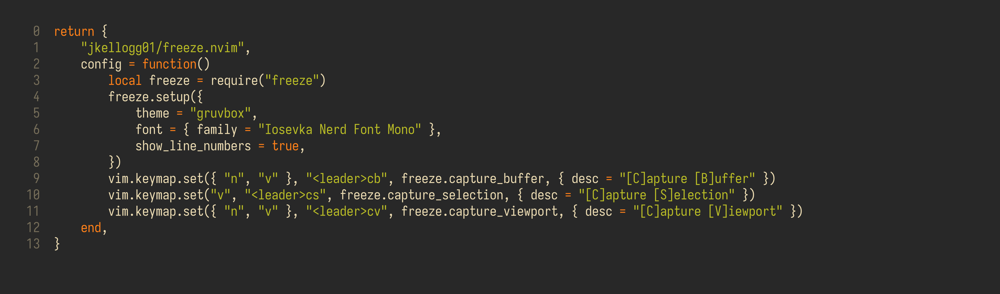

# freeze.nvim

this readme will get better but there are other things to do! so sorry!

## usage

Here's my LazyVim plugin spec for using freeze.nvim,
this should be plug and play for most people except without the font

